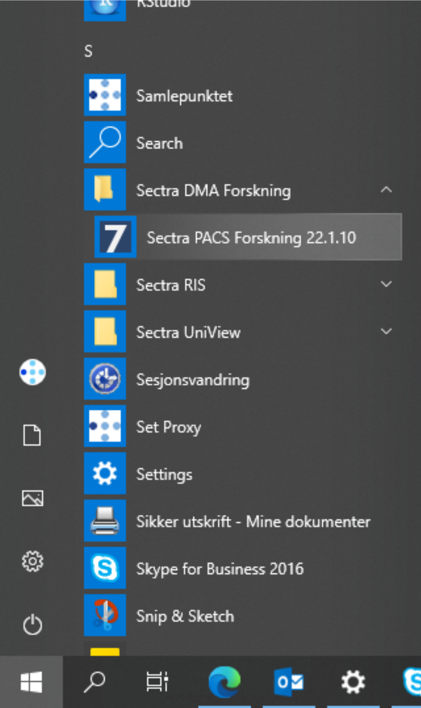

LEARN
======

**For:** Doctors, researchers, medical personnel

.. toctree::
   :maxdepth: 1

How to apply to the Research Information System Helse Vest
-----------------------------------------------------------

1. Project creation, setup and access
~~~~~~~~~~~~~~~~~~~~~~~~~~~~~~~~~~~~~~

In order to apply for a new project on the research information system (research PACS)
please fill out the application form available under “Apply/Apply for a new research project”
here: `<https://www.google.com>`_ or `<ttps://fiona.medtek.hbe.med.nvsl.no/>`_.

Additional user access can be requested by the principal investigator of the project under
“Apply/Apply for access to an existing project”.

If you encounter any problems with applying for access, contact Hauke.Bartsch@helse-bergen.no.

2. Access to REDCap for structured data
~~~~~~~~~~~~~~~~~~~~~~~~~~~~~~~~~~~~~~~~

Our project uses REDCap as an electronic data capture solution. Projects on the research information system can receive access to their REDCap project as well as access to the image data viewing (see next section).

3. Access to the “Sectra DMA Forskning” research PACS viewer
~~~~~~~~~~~~~~~~~~~~~~~~~~~~~~~~~~~~~~~~~~~~~~~~~~~~~~~~~~~~~

Access to the image data is provided by IKT. Such access requires a valid Haukeland University Hospital user account and a laptop or PACS workstation that is under control of IKT. If you contact IKT ask for the start menu item “Sectra DMA Forskning”. With the program and your hospital username and password you will gain access to the research picture archive and communication system (PACS).

Without access to a specific research project you will not see any data in the research PACS. Each research projects requires specific permissions to become accessible for a user.

The research PACS viewer is using a separate clinical PACS software installation (Sectra IDS7). In order to prevent possible interactions between the clinical and the research PACS only one of the application can run at a given time. You will be logged out of the clinical PACS if you start the research PACS viewer.

   Forskning PACS start menu icon required to view image data by project.

4. Submit data to the Research Information System
~~~~~~~~~~~~~~~~~~~~~~~~~~~~~~~~~~~~~~~~~~~~~~~~~~

Overview: The research information system contains two components. Image data is stored in the Sectra DMA Forskning - an image viewer with a vendor neutral archive (VNA). All meta-data is stored in table format in an electronic data capture system (REDCap). Sending image data will create the appropriate entries in REDCap. Additional data collection instruments can be set up there and used to capture assessments, consent/assent and results from automated image processing. All image data is assigned to a project to allow for project specific data views for each research information user.

The basic steps to submit data are:

1. Send DICOM studies to “HBE Fiona” or “Fiona” (modality station)
2. Assign to project on `<https://fiona.medtek.hbe.med.nvsl.no/applications/Assign/>`_

In step 1 data arrives in a **quarantine** location. In step 2 each DICOM study needs to be **assigned to project**, pseudonymized participant identifier and event name before it will be forwarded to the research PACS and becomes visible to the project users.

4.1 Setup of a new project
^^^^^^^^^^^^^^^^^^^^^^^^^^^

The project needs to exist on the research information system before participant data is collected. After a successful setup your project and event names should appear in the Assign application.

4.2 How to add image data
^^^^^^^^^^^^^^^^^^^^^^^^^^

The end-point for images is FIONA (`<https://fiona.ihelse.no>`_):

- AETitle: FIONA
- IP: 10.94.209.30
- Port: 11112

Images that arrive at this endpoint are added to a quarantine system (FIONA, `<https://fiona.medtek.hbe.med.nvsl.no:4444>`_) running the REDCap software. Automatic routing rules (stored in REDCap) are used to anonymize and forward the data to the image storage. If such routing has not been set up the “Assign” application (see below) needs to be used to forward individual studies based on pre-existing patient ID lists.

From Sectra Production you can send image data to the endpoint “HBE Fiona”. Modality stations might also have the “FIONA” endpoint setup. If the data is already anonymized and has a de-identified PatientName/PatientID entry that indicates the project the FIONA system will attempt to de-identify (pseudonymization) further DICOM tags and forward the images to IDS7 (may take minutes). No further action is needed. If you suspect this did not work, see the corresponding section about the representation of transfers in REDCap.

Image data that contains patient information cannot be automatically assigned to the appropriate project as there is only a single endpoint for FIONA shared by all projects. To assign participants correctly to projects and de-identified participant identifiers a user can perform the assignment to project, participant ID and event name in the “Assign” web application.

If the participant identifiers do not exist yet user may add new project specific identifiers in “Assign”. Such identifiers need to follow the naming rules for a project and are verified using regular expression pattern specific for each project.

The web application for the assignment of scans forwarded to HBE Fiona is available at:
`<https://fiona.medtek.hbe.med.nvsl.no/applications/Assign/>`_

On the Assign website look for your forwarded study. It should appear in about 15 min.
Identify the correct scan using the Accession Number (Undersøkelse-ID) or the date and time
of the scan. Select your project from the drop-down. This will fill in the list of patient names
and event names. Select the correct patient name and the event this study belongs to. After
a couple of seconds a new button appears below the study entry. Use it to select and
confirm the assignment. This will forward a de-identified version of the study data to “Sectra
Forskning”. If you do not assign your data on Assign they will not be forwarded. After a
couple of days (7 days) such data will disappear from the list. Send an email to Hauke to request
a resend.

4.2.1 Verification steps
^^^^^^^^^^^^^^^^^^^^^^^^^

After data arrived at the research PACS a verification step should ensure that all images have been received at the quarantine on FIONA and have been forwarded to research PACS. This can be done by comparing the number of images on the sending station with the number of images in IDS7.

Furthermore the import step will also attempt to de-identify secondary capture images with burned in image information. This process is fully automated and can result in false positive and occasionally false negative results. After a review of the data in IDS7 the user may decide which secondary image series are “safe” to exclude from the pixel rewriting on import. For example a secondary capture series from DTI may not contain any burned in names or identifying numbers or dates. Such image series can be removed in REDCap from further pixel anonymization.

If the number of images on FIONA does not correspond to the number of images available cache previous assignments and automatically forward such images to the research PACS using the reviously defined project, patient identifier and event name.

5. Export image data from research PACS
~~~~~~~~~~~~~~~~~~~~~~~~~~~~~~~~~~~~~~~~~

Data in the research PACS is secured by generic procedures during data import that delete or rewrite some DICOM tags, changes dates and replaces unique identifiers. A documentation of this process is available on the GitHub repository of the projects for removal of DICOM meta-tags:
`<https://github.com/mmiv-center/DICOMAnonymizer>`_, and for the removal of burned in image information: `<https://github.com/mmiv-center/RewritePixel>`_.

Data stored in the research PACS is therefore in general suited for data sharing IF pseudonymized data is allowed. In order to support users with the task of data pseudonymization the research information system provides the “Review” web application that lists all existing DICOM tags in a research project (`<https://fiona.ihelse.net>`_).

.. note::

   Pseudonymized data is defined here as data for which a coupling list exists somewhere in the universe. This is in contrast to anonymized data where such a list does not exist and can also not be created.

Further de-identification procedures might require changes to image data such as face stripping, removal of outer ear tissue, cortical folding pattern, etc.. Such potential sources of information for re-identification have been proposed in the literature but actual attacks based on them have not recently been documented. Better documented and perhaps more relevant are re-identification using spreadsheet data where external sources are linked to the projects data to discover the supposedly hidden identity of the research participants. For example it might be possible to link Gender, day of birth and the hospital name to a real participant name using a birth or voting registry.

5.1 Export using IDS7
^^^^^^^^^^^^^^^^^^^^^^

The image data from a study can be exported from the research PACS using a right-click menu entry available in the Informasjonsvindu “Exporter til medium”. Such exports will generate either a derived patient ID – if an Anonymization Profile is selected or a faithful copy of the data with all pseudonymized DICOM tags intact.

.. note::

   This export does not prevent re-identification. Specifically the PatientID field is created from the pseudonymized ID used in the research PACS and therefore not random.

The export is also case-by-case, which is tedious if many data need to be exported. The export will also result in directory names that do not reflect the research project structure as participant identifier – event name – modality – image series. It may be advantageous to export from IDS7 if a single image study needs to be shared without special requirements. Such export folders will also contain an image viewer.

5.2 Export to project specific formats, NIfTI and zip-files
^^^^^^^^^^^^^^^^^^^^^^^^^^^^^^^^^^^^^^^^^^^^^^^^^^^^^^^^^^^^^

The research information system supports a separate export facility that is more suited to implement project specific de-identification. Such export requirements include specific DICOM value changes (replacing underscores with dashes), adding birth date information back, formatting and cleaning of series descriptions, zip-file exports with specific folder structures etc.. This export is appropriate if the receiving institution has specific requirements on how data should be shared.

Request access to the specialized data exports for your project from Hauke.Bartsch@helse-bergen.no. Provide your export specification and we will implement your anonymization scheme and make it available to you and other researchers. As an example the “Export” application currently supports the export in NIfTI formats (using dcm2niix) and the export in several zip-file formats.

6. Research Information System
~~~~~~~~~~~~~~~~~~~~~~~~~~~~~~~

The research information system (RIS) of the Western Norway Health Authorities (Helse-Vest) also called the "Steve Project" is a secure computer system that stores research data for approved research projects at Haukeland University Hospital and connected hospitals of the Helse Vest region. The project is supported by the radiology department of Haukeland University Hospital and the Mohn Medical Imaging and Visualization Center and approved for research project use by IKT Helse Vest. The physical location of the data is at the premises of IKT Helse Vest Norway. Dedicated storage area and research software (Sectra, IDS7) provides researchers with appropriate permission access to their data. All data is stored in a de-identified format inside the RIS. Maintaining a coupling list is the responsibility of each project and not part of the functionality of the RIS.

Based on the REK/DIPA rules for each project a lifetime tracking of the research data per project ensures that data can be anonymized based on data sharing requirements, and that data can be deleted at the end of the project phase - if required. We suggest that research data is allowed to be fully anonymized at the end of the project and remain in RIS for general research access.

Key features of the RIS include:

- Hosted side-by-side with the clinical PACS as an independent installation.
- Accepts de-identified patient identifiers only.
- All data is moved through a de-identification process upon import into RIS.
- All data is assigned to one or more specific research projects and the visibility of data is restricted to individuals with project role access rights.
- Projects require a valid REK approval, such documentation has to be provided at the start of a project by the project owner.
- The project owner can identify additional user accounts that can access the data.
- User access to the research PACS is controlled by IKT and requires a valid Haukeland University Hospital user account.
