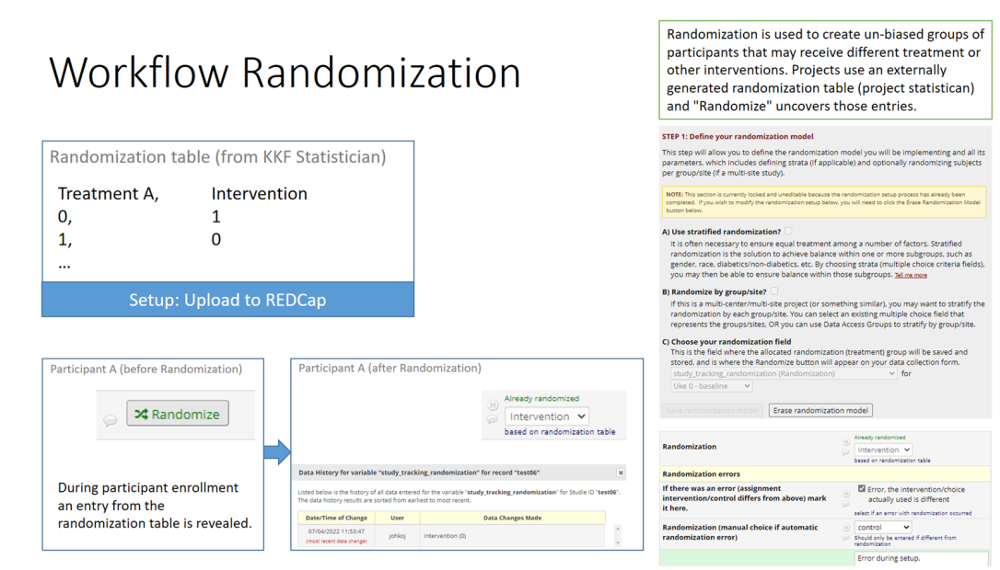
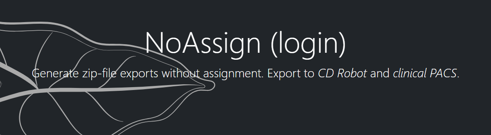

########################
End User Documentation
########################

**For:** Doctors, researchers, medical personnel

***************
Fiona system
***************

The Fiona system is a comprehensive solution for managing DICOM medical images in a research environment. The system enables automatic reception, processing, anonymization, and transfer of imaging data between Clinical and Research PACS (Picture Archiving and Communication System) systems.

.. figure:: ../_static/fiona-dark.png   
   :align: center

   Fiona front page.

New project: creation, setup and access
=========================================

Apply for a new project
-------------------------

In order to apply for a new project on the research information system (research PACS)
please fill out the application form available under “**Apply for a new research project**”.

Additional user access can be requested by the principal investigator of the project under
|fiona-apply_name|“**Apply for access to an existing project**”.

If you encounter any problems with applying for access, contact |admin_url|.

Access to REDCap for structured data
---------------------------------------

Our project uses |redcap-main_link| as an electronic data capture solution. Projects on the research information system can receive access to their REDCap project as well as access to the image data viewing (see next section).

Access to the “Sectra DMA Forskning” research PACS viewer
------------------------------------------------------------

Access to the image data is provided by your |it_name|. Such access may require a valid local hospital user account and a laptop or PACS workstation that is under control of IT Department. If you contact IT Departmetnt ask for the start menu item “**Sectra DMA Forskning**”. With the program and your hospital username and password you will gain access to the research picture archive and communication system (PACS).

Without access to a specific research project you will not see any data in the research PACS. Each research projects requires specific permissions to become accessible for a user.

The research PACS viewer is using a separate clinical PACS software installation (Sectra IDS7). In order to prevent possible interactions between the clinical and the research PACS only one of the application can run at a given time. You will be logged out of the clinical PACS if you start the research PACS viewer.

.. figure:: ../_static/sectra-2.png   
   :align: center
   :scale: 75%

   Forskning PACS log-inn window to view image data by project.

Submit data to the Research Information System 
=================================================

**The Research Information System** (RIS) contains two components. First, image data is stored in the Sectra DMA Forskning - an image viewer with a vendor neutral archive (VNA). Second, all meta-data is stored in table format in an electronic data capture system REDCap, that is Fiona server on port 4444, (|fiona-redcap_url|). Sending image data will create the appropriate entries in |fiona-redcap_name|. Additional data collection instruments can be set up there and used to capture assessments, consent/assent and results from automated image processing. All image data is assigned to a project to allow for project specific data views for each research information user.

The basic steps to submit data are:

1. Send DICOM studies to Fiona (either from clinical PACS or direct from modality station)
2. :ref:`assign` to project on |fiona-assign_name|.

In step 1 data arrives in a **quarantine** location. In step 2 each DICOM study needs to be **assigned to project**, pseudonymized participant identifier and event name before it will be forwarded to the research PACS and becomes visible to the project users.

.. container:: responsive-images

   .. container:: image-item

      .. figure:: ../_static/assign-1.jpeg
         :width: 100%
         
         :ref:`assign` web application (upper view). Data in queue to be assigned to a project, after sending them to Fiona. 

   .. container:: image-item

      .. figure:: ../_static/assign-2.jpeg
         :width: 100%
         
         :ref:`assign` Web application (lower interface). Transfer history panel showing current uploads and recently completed data transfers.

How to send examination to Fiona
-----------------------------------

**From clinical PACS**

- Find the relevant examination in clinical Sectra PACS (PACS PROD). Click the right mouse button and "Define it as current examination"
- Click the right mouse button and select "send til teleradiologidestinasjon" (send to teleradiology destination). Choose the destination "HBE Fiona".

**From modality**

Fiona must be added as a sending destination on the modality.

How to send from Fiona to fPACS (Sectra)
------------------------------------------

- Go to fiona.ihelse.net (RIS)
- Select :ref:`assign` appllication. 

   - Find and click on the examination you have sent under "Study list"
   - Check Study date/time and description. Accession number should match the examination ID in clinical Sectra if the examination was sent from there.
   - Select project name from dropdown menu
   - Enter the participant's study ID (participant). You can add more participants under "Add a new name here", if participant IDs are not entered beforehand.
   - Select event from dropdown menu
   - Hold mouse pointer over blue line and click on the box that appears "transfer to study xxxx as ID for event xx"
   - A pop-up window "Are you sure" appears. Check that the info is correct.
   - Press "save" to send to fPACS

Setup of a new project
-----------------------

The project needs to exist on the research information system before participant data is collected. After a successful setup your project and event names should appear in the :ref:`assign` application.

How to add image data
-----------------------

The end-point for images is Fiona:

- AETitle: |fiona-AETtitle_name|
- |fiona-local-ip_name|
- Port: 11112

Images that arrive at this endpoint are added to a quarantine system (Fiona, |fiona-redcap_url|) running the REDCap software. Automatic routing rules (stored in REDCap) are used to anonymize and forward the data to the image storage. If such routing has not been set up, the “Assign” application (see below) needs to be used to forward individual studies based on pre-existing patient ID lists.

From Sectra Production you can send image data to the endpoint “HBE Fiona”. Modality stations might also have the Fiona endpoint setup. If the data is already anonymized and has a de-identified PatientName/PatientID entry that indicates the project the Fiona system will attempt to de-identify (pseudonymization) further DICOM tags and forward the images to IDS7 (may take minutes). No further action is needed. If you suspect this did not work, see the corresponding section about the representation of transfers in REDCap.

Image data that contains patient information cannot be automatically assigned to the appropriate project as there is only a single endpoint for Fiona shared by all projects. To assign participants correctly to projects and de-identified participant identifiers a user can perform the assignment to project, participant ID and event name in the :ref:`assign` web application.

If the participant identifiers do not exist yet user may add new project specific identifiers in :ref:`assign`. Such identifiers need to follow the naming rules for a project and are verified using regular expression pattern specific for each project.

The web application for the assignment of scans forwarded to HBE Fiona is available at: |fiona-assign_name|. 

On the :ref:`assign` website look for your forwarded study. It should appear in about 15 min.
Identify the correct scan using the Accession Number (Undersøkelse-ID) or the date and time
of the scan. Select your project from the drop-down. This will fill in the list of patient names
and event names. Select the correct patient name and the event this study belongs to. After
a couple of seconds a new button appears below the study entry. Use it to select and
confirm the assignment. This will forward a de-identified version of the study data to “Sectra
Forskning”. If you do not assign your data on Assign they will not be forwarded. After a
couple of days (7 days) such data will disappear from the list. Send an email to |admin_url| to request a resend.

Verification steps
--------------------

After data arrived at the research PACS a verification step should ensure that all images have been received at the quarantine on Fiona and have been forwarded to research PACS. This can be done by comparing the number of images on the sending station with the number of images in IDS7.

Furthermore the import step will also attempt to de-identify secondary capture images with burned in image information. This process is fully automated and can result in false positive and occasionally false negative results. After a review of the data in IDS7 the user may decide which secondary image series are “safe” to exclude from the pixel rewriting on import. For example a secondary capture series from DTI may not contain any burned in names or identifying numbers or dates. Such image series can be removed in REDCap from further pixel anonymization.

If the number of images on Fiona does not correspond to the number of images available cache previous assignments and automatically forward such images to the research PACS using the previously defined project, patient identifier and event name.

Features for data migration
-----------------------------

The |fiona-assign_name| (:ref:`assign`) web-application allows users to upload a coupling list that maps the accession
number (Undersøkelse-ID) of the study to the pseudonymized participant identifier. Such
mappings must be uploaded before the first image study of the project has been forwarded
to Fiona. Incoming DICOM studies in Fiona that match entries in the coupling list will
automatically be assigned to the project.

How to handle errors?
-----------------------

Correcting errors during data import are not difficult to fix. Try to follow up on such errors
on an ongoing basis. The quarantine Fiona station may have still have a copy of the data in
its cache which simplifies the process. Contact |admin_name| in such cases and ask for help. This will allow you to fix issues such as:

• wrong assignment of participant identifiers to DICOM studies,
• wrong assignment of event names to DICOM studies,
• missing images or image series for existing DICOM studies,
• missing entries for DICOM studies on :ref:`assign`.

Export image data from research PACS
======================================

Data in the research PACS is secured by generic procedures during data import that delete or rewrite some DICOM tags, changes dates and replaces unique identifiers. A documentation of this process is available on the GitHub repository of the projects for removal of DICOM meta-tags: |github-dicomanonymizer_link|, and for the removal of burned in image information: |github-rewritepixel_link|.

Data stored in the research PACS is therefore in general suited for data sharing IF pseudonymized data is allowed. In order to support users with the task of data pseudonymization the research information system provides the :ref:`review` web application that lists all existing DICOM tags in a research project on Fiona.

.. note::

   Pseudonymized data is defined here as data for which a coupling list exists somewhere in the universe. This is in contrast to anonymized data where such a list does not exist and can also not be created.

Further de-identification procedures might require changes to image data such as face stripping, removal of outer ear tissue, cortical folding pattern, etc.. Such potential sources of information for re-identification have been proposed in the literature but actual attacks based on them have not recently been documented. Better documented and perhaps more relevant are re-identification using spreadsheet data where external sources are linked to the projects data to discover the supposedly hidden identity of the research participants. For example it might be possible to link gender, day of birth and the hospital name to a real participant name using a birth or voting registry.

Export using IDS7
------------------

The image data from a study can be exported from the research PACS using a right-click menu entry available in the Informasjonsvindu “Exporter til medium”. Such exports will generate either a derived patient ID – if an Anonymization Profile is selected or a faithful copy of the data with all pseudonymized DICOM tags intact.

.. note::

   This export does not prevent re-identification. Specifically the PatientID field is created from the pseudonymized ID used in the research PACS and therefore not random.

The export is also case-by-case, which is tedious if many data need to be exported. The export will also result in directory names that do not reflect the research project structure as participant identifier – event name – modality – image series. It may be advantageous to export from IDS7 if a single image study needs to be shared without special requirements. Such export folders will also contain an image viewer.

Export to project specific formats, NIfTI and zip-files
-----------------------------------------------------------

The research information system supports a separate export facility that is more suited to implement project specific de-identification. Such export requirements include specific DICOM value changes (replacing underscores with dashes), adding birth date information back, formatting and cleaning of series descriptions, zip-file exports with specific folder structures etc.. This export is appropriate if the receiving institution has specific requirements on how data should be shared.

Request access to the specialized data exports for your project from |admin_name|. Provide your export specification and we will implement your anonymization scheme and make it available to you and other researchers. As an example the :ref:`export` application currently supports the export in NIfTI formats (using dcm2niix) and the export in several zip-file formats.

******************
End-user contract
******************

.. attention::

   The following text is from the Apply website for the Fiona system. Please check this page for updates to the wording.

By creating a project on the research information system you agree to the following:

1. All data stored in the RIS belongs to the research project owner represented by the PI of the project. Adding and verifying added data to the RIS is the responsibility of the project owner. The RIS team will help research projects to automate this process.

2. Sensitive participant information needs to be stored under a separate account and needs to be accessible to authorized (data-manager and above) user accounts only. All other research data is stored as de-identified data (pseudonymized, with external coupling list) or in an anonymized format. This restriction includes sensitive information such as Norwegian identification numbers, real names or parts of real names, other birth certificate information and initials. It is the responsibility of the project to review the result of the de-identification procedures implemented by the RIS team on image meta-data using :ref:`review` application and the result of the detection and removal of burned in image data (IDS7). The project will inform the RIS team in a timely manner if the pseudonymization procedure of the RIS team needs to be updated. This restriction is in place to allow for the largest possible user base for the RIS including PhD students and external collaborators.

3. All research data is stored as part of RIS projects identified by a project name  of 5-20 characters. Users can gain access to the data upon request from the project PI or an appointed representative of the PI. 

4. Projects are expected to utilize best-practises for data handling such as  accounts based on roles like data-entry (add data only) and data-manager (change data, export data). Personally identifying fields have to be marked as such (Identifier? field of the instrument designer) and data access groups shall be used for multi-site project setups.

5. Projects will undergo a short review from the RIS team before they are moved by the RIS team from development mode into production mode for data capture. This review may generate suggestions for the project on how to implement best practices for longitudinal data captures, missing validation and the use of additional software features. All research data is collected and stored with a valid REK approval for the time period specified in the REK approval. The REK approval is required at the time that the RIS project is created. Any change of the REK approval start and end dates need to be
reported to the RIS team. At the end of the project period data can be either a) deleted or b) fully anonymized (suggested choice). It is up to the project to inform the RIS team about the correct way of handling the data at the end of the project. By default we will assume that data needs to be deleted. Based on the project end date (REK) the RIS team will inform the PI of the project of a pending change of the project status to the archive state. An archive state project will not allow for further data entry, or changes to captured data. After a period of about 1 year the project data will be exported and provided to the project PI for download. An archived project can be deleted by the RIS team after an unspecified time period. If the project data can be fully anonymized, the RIS team may create a copy of the data with new participant identifiers (without a coupling list). After a re-import a fully anonymized version of the project data can become accessible to other RIS users. The original project
data will change to archive state, a copy is provided to the projects PI and the data can be deleted by the RIS team after about 1 year.

************************
Sensitive Data Projects
************************

Separation of Sensitive Information and Data
==============================================

A sensitive data project is one that is used to capture human subject data and in general will require  REK (regional ethics board approval). In order to setup such a project in REDCap we suggest the follow structure and features of REDCap to be used. These recommendations have been generated based
on discussions in relevant risk assessments.

All sensitive data should be stored in a separate REDCap “ID” project including Norwegian Identification Numbers, names or parts of names, addresses and full birth dates (see :ref:`REDCap: sensitive data project<fig-redcap-sensitive-data>`). This project should have its own roles of “Data Manager”, “Data Entry”, and “Controller”. People with permission to access and/or edit this information can use this database to keep contact information up-to-date and to enroll new participants into the study. Each participant should be assigned a pseudonymized ID in the sensitive data project that links the entry to the corresponding participant in the data project. Examples for this ID are:

- <project name>-<site number>-0001,
- <project name>-<site number>-0002,
- etc..

.. _fig-redcap-sensitive-data:

.. figure:: ../_static/redcap-sensitive-data.png   
   :align: center
   
   Sensitive data projects should be split into a REDCap project for data (using pseudonymized ids) and a REDCap project for sensitive data including the coupling list.

All other data should be stored in a separate REDCap “Data” project using the pseudonymized articipant ID as a “record_id” (first field in the study).

User rights management
========================

When a project leader/principal investigator (PI) is given a REDCap account and project, they are given “project owner” roles. The project owner can then provide access to project members in “roles”. A role defines a given set of custom permissions which defines the user’s access to data, export permissions and ability to make changes to data.

Each project can have predefined roles. We recommend the predefined roles:

- "Data Manager" (ability to change study design, export),
- "Data Entry" (add, change, or delete data),
- "Controller" to define roles for data viewing, editing, and deleting records.

In more complex cases, different access settings can be given on different forms in the study. Individual users are assigned to project roles as part of gaining access to one project.

The user rights management is the responsibility of the project owner and/or the users they add to the project with User Rights access. User roles should be set at the lowest access level that is necessary (e.g., export rights only for users who need this permission). Access to the project should be reviewed regularly and personnel who no longer require access need to be removed from the project.

User rights – multi-center projects
====================================

In a project where several institutions participate with their own project participants (several hospitals etc.) each group of participants should be assigned to a separate “data access group”. This functionality allows records in a study to be part of the user rights management. A user with access to a single data access group can only see participants that belong to this group. If this user creates a new participant, they will be automatically assigned to the group.

How to handle Email Addresses in Data Projects
=================================================

Email addresses are special identifying fields that can be stored in data projects for the purpose of creating automated invites for participants to fill out forms from home. In projects that use this feature email fields need to be present in the data project in order to allow for email distribution to participants.

1. Add such email fields to a separate instrument of the REDCap data project and mark the instrument as viewable by specific roles only (like Data Managers).
2. Mark the email field as an “Identifier” field to prevent export of the field’s data by user  of roles that cannot view sensitive fields.
3. Add the Action Tag “@PASSWORDMASK” to the field to prevent accidental viewing of the fields values if the instrument is displayed on screen.
4. Add a field validation as “Email” to prevent some miss-typing of emails.

Randomization
---------------

Randomized studies have can remove biases caused by selection of participants for specific arms in a study. Such biases can prevent a fair assessment of a treatment option. The randomization feature of REDCap allows users to upload a randomization table that has been externally created before the start of the study – usually by the statistician of the project. After participants are enrolled into the study the randomization entries for that person are “opened” and the choice of the randomization is stored in the project.

   Basics of the randomization workflow in REDCap.

e-Consent
-----------

In an e-Consent workflow the basics of the paper informed consent are maintained. An electronic consent document is created based on the approved language and design of the paper consent using HTML features in REDCap. The solution supports signature fields (stored as images) and creates resulting PDF (paper) versions of the consent as well as electronic versions of the consent. The following figures show some of the setup and resulting documentation that is created in the solution.

   Setup of e-Consent in REDCap with identification of typed information for participant name and signature fields.

We suggest exporting e-Consent documents and to store them centrally by the project administration outside of REDCap.

   Example e-Consent document structure (left) with (right) visual representation and signature (middle, bottom).

As informed consent document contain the name of the signatory and the one countersigning the informed consent process the e-Consent workflow should be implemented in the sensitive data (ID) REDCap project.

   Internal documentation of e-Consent in REDCap. Signatures have been captured and tracked. A paper version for export is available.

Automatic data exports from REDCap
-----------------------------------

Data may be exported from REDCap using the REDCap API, a technical interface to automate the export of project and participant information using scripting. To provide such access a dedicated user-account "api_<real username>" should be created which is specific for a single project. Configure the account with a limited set of read permissions to specific fields or instruments using a new API role. The REDCap API will borrow these restrictive permissions for controlled access.

Setup: An administrator can generate an API "token" for this account and share the token and examples of accessing the resource (curl-based access) with the user.

Any change in the role of the <real username> should also apply to the connected API account. Specifically loosing access to the project should be implemented for both <real username> and api_<real username>.

Steps at the end of a REDCap project
--------------------------------------

REDCap is a tool for data collection. At the end of data capture projects using REDCap receive a notification of study end. At this point projects may provide updated REK information (extension of data capture notice). If no such notice is received REDCap projects will:

- Lock all data participants (no further update/add).
- Provide a copy of the REDCap project (CDISC format) to the project’s principal investigator or delegate.
- Provide a copy of the project data (CSV) and data dictionary (PDF) to the principal investigator or delegate.
- Request a confirmation that project data (CDISC and CSV) have been received by the project.
- Permanently delete all project data.

    
    End-of-project tracking for REDCap projects

This process will be documented in the REDCap project tracking project “DataTransferProjects”, the project management tool with information on identity of the person requesting project removal and confirmations for all steps of the project removal process.

****************************
Frequently asked questions
****************************

How do I start using the system?
=================================

Creating a project for your data is of course the first step. One the frontpage of Fiona use the link at the top to |fiona-apply_name| for a new research project. After you got access from IKT to the "Sectra DMA Forskning" start menu link you can login there and see your empty project. Start by uploading data to your project following the steps in **How to add image data**.

Creating a project for your data is of course the first step. One the frontpage of Fiona use the link at the top to apply for a new research project. After you got access from IKT to the "Sectra DMA Forskning" start menu link you can login there and see your empty project. Start by uploading data to your project following the steps in How to send data. Information about these first steps are available in the EK handbook (see Forskning / Forskningsprosedyrer, 02.20.7.1 Forsknings PACS).

Where does the data come from?
===============================

Both clinical and research systems are provided as services inside the hospital system. Whereas the clinical system supports the day-to-day workflows for patient care its sister system for research provides data services on a research cohort level. For imaging data both systems receive data directly from clinical scanners and enrollment into research projects is used by the scanner operators to decide if data is send to both systems or to the research PACS only. Imaging data may also be imported from external media. Non-imaging data is captured in the research system using electronic data capture (EDC) in REDCap. Both the imaging system and the EDC secure access on the project level, provide anonymization procedures and access to the data using role based accounts. They support automated workflows for data analysis and data processing as well as data exchange with third parties.

Best practices for project setup
=================================

These are not rules, they are more like guidelines. They do may make the difference between an ok project and a project that is nice to work with (see FAIR data use).

 - A research PACS project is more than a copy of all participant data from the clinical systems. Only transfer data explicitly covered in your REK approval - this is actually a rule, not just a recommendation. Patients might be in the hospital and receive imaging appointments for a number of different purposes. Image studies not directly related to your research project should not be transferred. 
 - Limit the number of coupling lists to identify participants in your project. In the best case all project members should use a single pseudonymized (numeric) identifier for each participant linking imamging data with diagnostic information. A single coupling list of participant identifying information and pseudonymized identifier is optimal as it still ensures separate storage of sensitive information from data. 
 - Numerical identifiers for participant ids should use leading zeros ("project_001" instead of "project_1"). This allows for a consistent alphabetic sorting of participants in the research PACS Information window. The number of leading zeroes can be derived from the maximum number of participants in the study. 
 - Utilize non-numeric event names if your study is longitudinal. If you assign all image data to a single dummy event you will have more work later to specify baseline assessments needed for analysis (compute values relative to the baseline assessment etc.). If your project has an open number of events a two-event setup with "baseline" for the earliest good quality DICOM study and "followup" for all other DICOM studies is ok to use. All event-based studies should assign timing-based event names like "pre-op", "post-op", "6month", etc.. The event name is visible in the research PACS if you add the "Referring physician" column to the Information window. 
 - In order to support clinical studies a basic REDCap project (using RIS setup) contains five data collection instruments. 
 - *Basic Demography Form*: The entries in this form are used to link to the pseudonymized participant ID. All three fields usually contain the same value that is linked to the image information for PatientName and PatientID. 
 - *Imaging*: The imaging instrument is automatically populated by Fiona after each data transfer into the research PACS. The basic information captured is the study instance UID, event name, (shifted) study date and the study description. 
 - *Pathology*: The pathology instrument adds to the imaging instrument measures related to pathology imaging such as magnification factors, resolution and stain information based SNOMED-CT. 
 - *Adverse Events*, *Monitoring*, *Record Locking*, *Source Data Verification*: This instrument captures information required for clinical study type data capture. For each participant in the study all found adverse events (AE), serious adverse events (SAE) and suspected unexpected serious adverse reaction (SUSAR) are captured. The instrument includes also a section on medication monitoring, documentation for record locking and a section to document a source data verification step. Not all projects, especially non-clinical drug trials will need all of these fields. Adjust the instrument for your own study as needed. 
 - *e-Consent*: The template for electronic consent shows the use of signature fields to authenticate both the consenter and the consentee. Notice that HTML formatting for e-consent will be removed in the resulting PDF documenting the consent process (restriction of REDCap). Use the section headers as shown in the template file to obtain a better structured PDF version of the consent. Use images and the logo to style your consent.

Adjust instruments that you find useful in your study. Remove any instrument that you do not need.

Can data be deleted?
=====================

You will not have permission to delete data yourself - but you can request data to be deleted from the system. Send an email to Hauke with the project name and detailed information of which participant, event, study, and series should be removed. With the same workflow you may request replacement of participants for which the wrong image series where submitted.

Can I use the research information system without an ethical approval (REK number)?
====================================================================================

We do accept projects without REK that are for operational support like scan quality control projects. As always, the project owner is responsible to ensure that such a project follows all institutional guidelines. Operational support projects need to agree to the same pseudonymization procedures as other projects.

How to handle participant data after removal of participant consent?
======================================================================

Participants can retract their consent to be part of a running research study at any time. One option for such data is to request a removal of the image data (send email to rDMA team/Hauke). If the data was already part of published research you as the researcher might also have an obligation to store the data in case your findings need to be verified at some point in the future. Not using data in future research and allowing for a later verification of already performed research can be difficult to implement. We suggest in this case that you use one of two approaches. i) Export the raw data that is part of your paper and store an offline copy together with your analysis scripts for any future questions that you might have to respond to. Request data where consent has been retracted to be deleted from the research PACS. All remaining data in the research PACS is therefore ok to include in the next paper. Or, ii) you can use the worklist functionality of IDS7 to create a new worklist ("Ny statisk arbeitsliste") of subsets of participants. We suggest in this case that you work with three worklists, one to track participants that have removed their content - such data remains on the system but such participant data should not be used for future studies. One worklist per publication that contains references to the imaging studies that have been used. And one master worklist with participants that are ok to use in future papers by your project.

What happens at the end of the project?
=========================================

The end date of a project is specified in the REK approval. We are using this information to inform you between 3 and 6 month before the end of the project. At this point you can request an extension of the project from REK. If such an extension has not be obtained the project data remains on the research PACS but access to the project will be removed by removal of the project role. The data will no longer be visible to you.

Can we send out emails to people at home?
==========================================

Yes, if your project is on "REDCap on Azure" people can answer to the links they receive by email. This is not possible on our internal (Fiona) REDCap. There are some limitations to this functionality on our REDCap on Azure system. Emails are routed through a Microsoft Exchange custom domain which limits outgoing emails from one system to at most 500 emails per minute and 2,000 emails per hour. That limit is shared for all projects on REDCap on Azure. To not interfere with other projects we suggest to use a lower limit of 1,000 emails per day. Contact us if you need to send out more emails per day.
You can help us to increase the number of emails that can go out at once by checking your list of email addresses. Make sure they are all valid. This can help us to improve the reputation of our custom domain which can lead to higher hourly and daily limits.

How to integrate with external vendors?
========================================

An external vendor might be a company that performs image analysis for you. This can be done in two basic ways - sending images to the cloud (difficult because of loss of control over data) and installing the vendor software inhouse (much easier). The process to integrate such an external vendor into the research information system includes a number of steps. Namely:
 - Check against existing systems
 - Budget control
 - Risk assessment
 - Data processing agreement
 - Contractual agreements
 - Data protection impact assessment

Whereas some of these steps are mandatory most are dependent on the type of integration and prior work. A working integration will allow you as a researcher to control the sending of images from the research PACS to the vendor software. The software will perform its task and any resulting images will appear back in your project in the research PACS.

How anonymous is the data in the research information system?
================================================================

As copies of the image data may exist in clinical systems, research image data is considered at least indirectly identifiable personal data. Data exported from the research PACS may retain that property and should be stored on secure systems. According to GDPR this may make it necessary to carry out a Data protection impact assessment (DPIA) prior to processing.

How anonymous is the data in the research information system?
==============================================================

As copies of the image data may exist in clinical systems, research image data is considered at least indirectly identifiable personal data. Data exported from the research PACS may retain that property and should be stored on secure systems. According to GDPR this may make it necessary to carry out a Data protection impact assessment (DPIA) prior to processing.

Do you change the data in any way?
====================================

Yes. With input from the project we attempt to anonymize all data forwarded into the project space. This includes changes to the meta-data section and changes to burned in image information of some of the incoming data (secondary captures). These data processing steps are implemented to ensure an anonymization of the data with respect to the Fiona system and a pseudonymization of the data towards the project as they may retain a coupling list.

Why are all the study dates wrong?
====================================

The study date is one of the easiest to obtain information in order to link imaging studies between the clinical and the research PACS. This re-identification of participants is discouraged for anyone who is not in possession of the projects coupling list. Accurate timing information of imaging studies may also be required to analyze image data. In order to serve both the need to keep study participant information private and the need to allow for good science we opted to shift data collection dates in a consistent way per project. Relative timing between imaging events is as accurate as in the clinical PACS. It needs to be stressed that this only prevents a direct path to re-identification. Data export using Fiona's "Export" application can be used to undo study date pseudonymization for data sharing that requires correct dates.

Is there a list of DICOM tags changed during import?
=====================================================

Yes, a list of about 270 tags inspected during import is available as part of the source code of the anonymization tool |github-dicomanonymizer_link| (|github-dicomanonymizer_url|). Tags listed with "remove" are deleted, tags listed with "keep" are kept etc.. The following list has been extracted from the anonymizer 2025-09-05.

.. csv-table:: The list of DICOM tags changed during import
   :file: sorted-dicom-tags.csv
   :header-rows: 1
   

CIM* - createIfMissing

The placeholder "PROJECTNAME" will be replaced with the name of the research project during pseudonymization.

Tags not listed above are untouched by the pseudonymization tool.

Can I export to TSD/Safe/HUNT cloud?
========================================

TSD supports data upload links. This API is expected by our system to allow a direct submission of data folders (zip-format) to your TSD storage space. This feature has to be setup for your projects, contact us to receive more information. There is no comparable technology for Safe yet. Contact Christine Stansberg to request such an interface.

The following information from your TSD project on (https://data.tsd.usit.no/i/) are required:

 - TSD group name:
 - TSD ID: e0b0c0e-abcd-abcd-abcd-a0b0c0d0e0f0 (example)
 - TSD user name.

For HUNT cloud the functionality relies on the 'sftp' data transfer protocol. Work on integrating these transfers to Fiona are ongoing.

Can I export to clinical PACS?
=================================

Yes, export to clinical PACS is possible using "NoAssign". Mostly this option allows pseudonymized data to be forwarded to other institutions using clinical PACS to PACS features like OneConnect.

In order to send to clinical PACS use the NoAssign application of Fiona. You may need "Export" permissions for your project to use this application. The application will list all studies currently found in quarantine on Fiona. Specify the project, participant, event information and the workflow type "Fiona anonymization". Select the examination you want to forward and "Export...". A dialog "Are you sure?" will allow you to select a destination in the final step. Both "CDRobot" and "clinical PACS" are supported destinations.

.. note::
   Additionally to the standard pseudonymization done by Fiona files will have a fake Date of Birth (0010,0030) DICOM attribute value of "19000101". This may be required if receiving PACS systems expect valid clinical data. By default the value of this attribute is empty inside research PACS. Only exporting data using NoAssign will add the dummy value.

*PACS to PACS connectivity*: If images pseudonymized on Fiona are forwarded to another PACS inform them on how to find your pseudonymized images. Tell them:

 - The AccessionNumber (Undersøkelse-ID) DICOM tag will start with the letters "Fiona" followed by some random letters and numbers.
 - The PatientName and PatientID tags will be the same (entered on Fiona, can be something like <project>_<numeric_id>, e.g. "TOBE_0022").
 - The ReferringPhysician DICOM tag will contain the name of the imaging event (e.g. "Eventname:baseline").
 - Further information on the pseudonymization procedure can be found here: |github-dicomanonymizer_url|

What other types of data can you store in PACS?
=================================================

Our PACS system can store image data from radiology, cardiology, urology, oncology (DICOM) and pathology (whole-slide image format). Other types of files can be embedded into DICOM and stored that way. For example, the Siemens Spectroscopy (DICOM) format (.ima files) can be stored and exported again. These files can be read successfully by spectroscopy software packages like OXSA. The Siemens TWIX format (.dat, .rda) are not suitable for PACS storage, use the .ima format instead.

Some of the spectroscopy DICOM files are non-image files. PACS viewers might not show them in the interface. In order to verify that they are stored correctly (other than downloading them again using Export) the Fiona system will add a secondary capture image that lists the hidden non-image objects including their size and series description.

The generation of the secondary capture image is currently limited to Siemens non-image files (SOPClassUID = 1.3.12.2.1107.5.9.1). Contact your Fiona team if you want to include other files.

.. _ris:

*****************************
Research information system
*****************************

We have created a research information system in response to common issues faced in integrating research algorithms into clinical practise. We started with a system that required many people to work together to provide access to research data, which does not sound like a bad thing, research is based on good cooperation between many people with diverse backgrounds. Looking at the type of things that needed to happen you realize that highly skilled hospital staff hand-carried a bag filled with 80 individual DVDs from one hospital area to another. Those DVDs each contained individually de-identified radiological images exported from an MRI machine where such a process may take up to 10 minutes per disk.

Based on these experiences we realized that many research tasks required for the successful running of a medical research study like data identification, data export, de-identification are not well supported if research institutions are setup as external entities to the health-care enterprise they are supposed to benefit.

The purpose of the Fiona Project is to create a research information system that no-one is affraid of using and that provides an interface between hospital procedures that generate data and research institutions that consume them. The system focuses on supporting two aspects of medical data - all the lab samples, questionnaires, diagnosis reports and clinical history and the medical image data in the form of DICOM images.

Safety first - Separation of hospital and research
===================================================

Our research information system is independent from the clinical systems at our hospitals. It is setup as a shadow system that connects to all hospital infra-structure and that has the overall shape and appearance of the clinical system but it is specifically geared to serve the needs of research projects.

How similar are the hospital and the research systems? Both hospital and research system use the same user accounts and permission services (active directory). This allows us to provide access to our research services with the same user-names and passwords as for the clinical system. Both the hospital and the research system use the same version of a vendor neutral archive and image viewing software (PACS). Whereas the instances of the clinical and the research system are separate and data storage is independent features of the clinical system like modality specific hanging protocols, image annotation tools and keyboard shortcuts are shared. This provides access to commercial image viewing software to researchers for data inspection and quality control which is essential for machine learning projects. For their clinical partners it provides a familiar interface to rate the products of research algorithms. Most importantly is removes the gap between the quality of data generated by research tools and the quality and level of automation that needs to be provided if they want to be evaluated for clinically use. This allows researchers to act as solution providers towards the hospital without the need for the integration of the research tools in commercial software applcations frist. Such a safe solution for the clinically relevant accelerated evaluation of novel solutions can help to understand the limitations of novel systems and limit the risks involved in the development of commercial solution.

Safety first - Separation of research projects
================================================

In a clincal setting a health region will share a single clinical system which helps limiting the costs of such systems. Each hospital will be setup to see parts of the data such as all information from the hospital itself but not nessesarily the information from patients at other hospitals. Often this is not a true separatation but it is enforced by individual worklists and role based permissions. A general patient search at one institution will still turn up patients scans at the connected hospitals in the health region. Whereas this is a feature for a clinical system a research information system needs to be more restrictive as access to data is more restricted by regional institutional review boards that allow for the use of research data in approved projects only.

Our system uses project access restrictions to provide a full separation of project data from each other. This includes project specific data identifiers in the VNA that allow project data to be used and deleted without interfering with other projects that might use the same patients data. Only users of the research PACS that are part of the projects role will have access to list the data and to see the assessments and images.

Safety first - Moving data between hospital and research
===========================================================

Data is transferred only from the hospital to the research information system, not the other way around. This limitation is not technical but operational. Only personnel with access to clinical data can forward such data to be added to a project in the research system. Such data transfers are possible from the clinical PACS as well as from modality systems at all Helse Vest hospitals that collect data as part of research studies.

We decided to store all image data and assessment data in a de-identified form before any analysis. As data is often collected by a research study as part of a general clinical workflow those data are labelled with patient identifying information. This includes names and identification numbers as well as sensitive information on where and when the data was collected. Such information is part of the medical file formats meta-data, burned into the pixel information in files and part of spreadsheets used to track the data.

The data de-identification is implemented as an automated process that connects the clinical systems of a hospital with the research system using an edge-device called Fiona. This system acts as an intermediary translation service that maps sensitive data to de-identified data in the research information system. Input required by the translation service is only a mapping of the clinical data to the particular project, the de-identified patient identifier and the event the data belongs to.

A system aware of study design
===============================

Whereas clinical system structures each patient individually in a research system participants are grouped on more levels for example by project, research arm, assessment event, imaging study, image series, and individual image. Such complex hierarchies allow for group level analysis of hundreds and thousands of participant data simultaneously without the need to individually export and handle the data. Especially the introduction of an associated event name to collected data allows for many features of statistical analysis. Our system includes these classifications in a central location for both the assessment as well as the image data. This limits the amounts of decision and assumptions that have to be made by various researchers in the structure of their analysis.

Study management and study tracking
======================================

Our research information system allows all participant data to be forwarded into the system at the time of data collection as part of a clinical study. There is no time-lag between when data is collected at a scanner and the time that image data is accessible in the research system. If technicians that collect the data are aware of the need to transfer the data into a specific project they will forward the data once to the clinical system - if that is required for safety reads - and a second time into the research systems edge device called Fiona. In a second step they need to assign the project, de-identified patient id and event name to the forwarded data. Such an identification step is the only requirement to map clinical data to the complex structure of research projects. After minutes the data becomes accessible to the research project in a proper de-identified manner.

Data translations from clinical to research system
====================================================

The list of meta-data tags that are removed by the Fiona edge system when data is assigned to a project is long. We document which tags are changed by making the source code and the process publicly accessible at our |github-dicomanonymizer_link|  page. We hope that this will improve the quality and security of our solution by allowing other groups to evaluate the software in their settings. This includes for example the need to evaluate the de-identified images generated by the software with other image distribution and viewing solutions and the need to test the data interpretation of the tool with new DICOM image files.

Some image data generated in the hospital setting will include textural information about the patient as burned in pixel information. This is common in some modalities such as ultra-sound but also appears in secondary capture images generated by specialized workstations applications for perfusion, diffusion and molecular imaging. Our research information system detects such images and attempts to automatically remove burned in image information by overwriting the detected areas with rectanges of a uniform color. Due to the fully automated process secondary capture images can be forwarded into the research PACS and are safe to use after a review by the project.

Specialized applications
===========================

To provide access to the feature of the research PACS we provide web-applications for data submission, project setup and configuration, review and data export. All of these features are accessible on the home page of the Fiona project page at the institution. Based on your role you will need to use only some of these applications.

.. _assign:

Assign
---------

.. raw:: html

   

The Assign application is the entry page for project data. The application lists incoming data that is in quarantine and allows the user to select the appropriate project, de-identified participant name and the event name of the imaging study. This is sufficient for a manual assignment of captured data as it is aquired in the hospital setting. For legacy data and external data in large quantities several automated import strategies are available. If data is de-identified outside of the research information system by writing a new patient ID such files are recognized by the edge system using either the send destination (AETitle of the addressed service on the edge Fiona) or by the pattern used in the patient ID. This detection of incoming data is used to detect the destination research project and trigger the de-identification step without another manual identification step. Additionally to such automated data routing the Assign application also provides a mapping table upload that can be used to identify project and event based on the datas accession number.

.. _export:

Export
-------

.. raw:: html

   

As data is already in de-identified format in the research PACS exporting them for the use in external systems is straight forward. The VNA system for example allows users to export individual imaging studies with an embedded image viewer in the same way as clinical systems do. To allow for greater flexibility in data export capabilities the Export web-application allows user to export image data for a project in a variety of file formats. This includes study specific zip files that follow detailed specifications on the embedded directory structures, side-loading description files and the naming of DICOM tags and dates embedded in the data. The Export tool also supports more generic export formats such as NIFTI-format files for volumetric data.

.. _noassin:

NoAssign
-----------

.. raw:: html

   

Fiona's NoAssign application can be used to pseudonymize data without adding them to research PACS. Studies need to be forwarded to Fiona.ihelse.net but will remain in quarantine there (for up to 7 days). If NoAssign is used during this time period the user may select a study from the list and either "download" the study as a pseudonymized zip file or forward the pseudonymized study to other clinical systems like "CDRobot" or "clinical PACS".

.. _review:

Review
--------

.. raw:: html

   

Any automated de-identification requires frequent review to ensure that the process is working as expected. In order to support this work by the research project without requiring technical expertise we provide the Review web-application that lists all remaining tags in the data after the anonymization.

.. _attach:

Attach
-------

.. raw:: html

   

Image data not already in clinical systems can be uploaded in the Attach application. This includes DICOM files from USB/CD/DVD as well as whole-slide images files for pathology. After uploading them using Attach they will appear in the list of examinations on Fiona and can be either forwarded to research PACS using Assign, or exported again using NoAssign.

.. _processing:

Processing
-----------

Processing of data is a step that links software into the research PACS. Data is forwarded from the project to the software which in turn sends result data back to the Fiona system. Those dataset are automatically forwarded to the research project and appear side-by-side with the original data. This type of integration requires a setup of the software and the setup of a send destination. Examples for such software endpoints are workstations from BrainLab and TeraRecon as well as data processing systems like CerCare and NeuroQuant.

System architecture
---------------------

The research PACS component is designed to run side-by-side with the clinical system.

.. figure:: ../_static/fiona-system-architecture.jpeg
   :align: center

   Research PACS integration into a hospital environment.

*********************
External resources
*********************

GitHub Repositories
=====================

#. |github-fiona_link| - |github-fiona_url|
#. |github-dicomanonymizer_link| - |github-dicomanonymizer_url|
#. |github-rewritepixel_link| - |github-rewritepixel_url|

REDCap
========

#. |redcap-main_link| - |redcap-main_url|