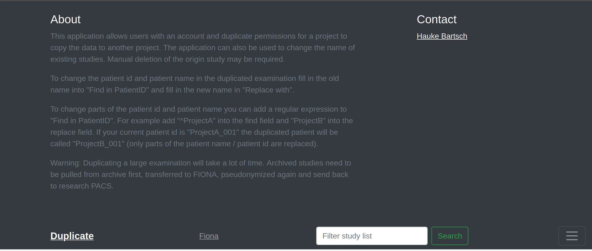
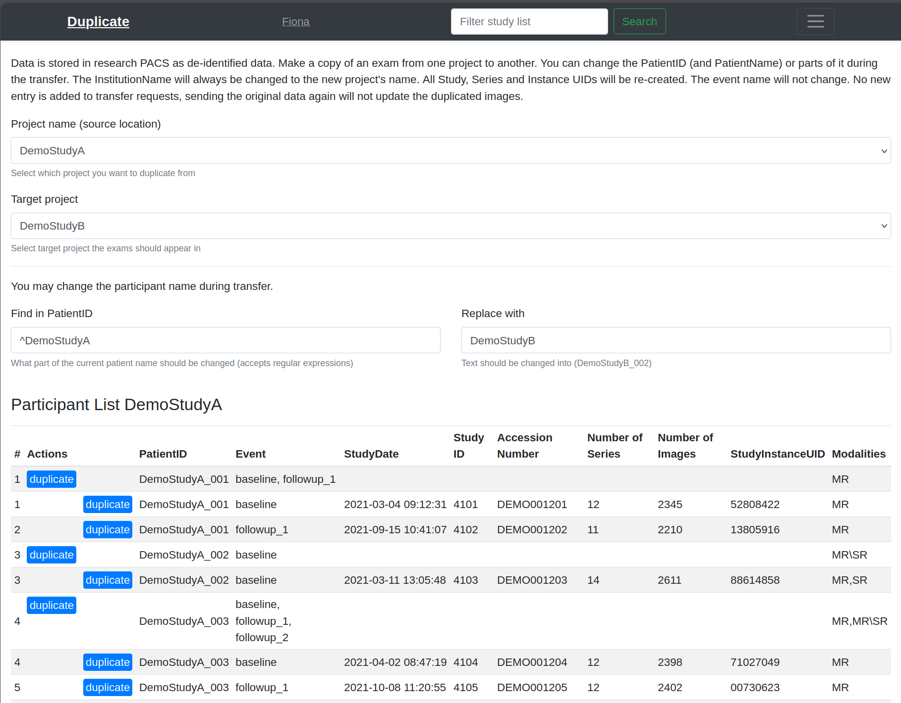

.. _duplicate-guide:

Duplicate
=========

The Duplicate application copies a study that is already stored in the research PACS from one project to another project.

   Duplicate web application. The "About" panel describes how the copy is created.

Access
------

You need an account with Export permission for the source project. The project lists show only projects you have access to.

Steps
-----

   Duplicate web application. Source and target project, PatientID replacement with preview, and the list of participants and studies.

1. Select the source project. The table lists the participants and studies of that project.
2. Select the target project. The fields "Find in PatientID" and "Replace with" are filled in with ``^<source project>`` and ``<target project>``.
3. Adjust the fields if needed. "Find in PatientID" accepts a regular expression; only the matched part is replaced. Example: ``^ProjectA`` → ``ProjectB`` changes ``ProjectA_001`` into ``ProjectB_001``. Hover over a "duplicate" button to preview the new ID.
4. Click "duplicate" on a patient row (all studies of the participant) or on a study row (a single study).

What changes in the copy
------------------------

- PatientID and PatientName are both set to the new ID.
- InstitutionName is set to the target project name.
- New StudyInstanceUID, SeriesInstanceUID and SOPInstanceUID are generated. They are derived from the original UIDs and the target project name, so duplicating the same study to the same project again produces the same UIDs.

What does not change
--------------------

- The event name.
- The original study stays in the source project. Delete it manually if needed.
- No new transfer request is created. Sending the original data again does not update the copy.

.. note::

   Large studies take a long time. Archived studies must first be retrieved from the archive.
