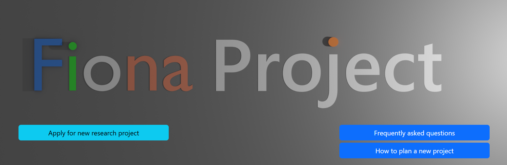

End User Documentation
************************

**For:** Doctors, researchers, medical personnel

.. toctree::
   :maxdepth: 1

Fiona system
--------------
The Fiona system is a comprehensive solution for managing DICOM medical images in a research environment. The system enables automatic reception, processing, anonymization, and transfer of imaging data between Clinical and Research PACS (Picture Archiving and Communication System) systems.

   Fiona front page.

.. include:: new-project.rst   
.. include:: submit-data-to-ris.rst
.. include:: export-image-data.rst
.. include:: end-user-contract.rst
.. include:: sensitive-data.rst
.. include:: faq.rst
.. include:: external-resources.rst