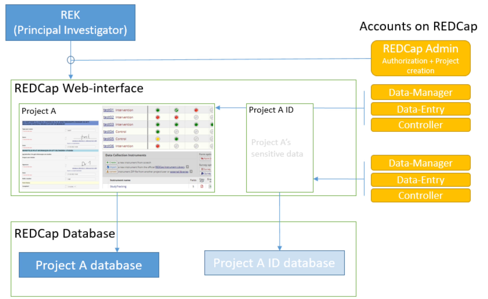

Sensitive Data Projects
------------------------

Separation of Sensitive Information and Data
^^^^^^^^^^^^^^^^^^^^^^^^^^^^^^^^^^^^^^^^^^^^^

A sensitive data project is one that is used to capture human subject data and in general will require  REK (regional ethics board approval). In order to setup such a project in REDCap we suggest the follow structure and features of REDCap to be used. These recommendations have been generated based
on discussions in relevant risk assessments.

All sensitive data should be stored in a separate REDCap “ID” project including Norwegian Identification Numbers, names or parts of names, addresses and full birth dates (see Figure 1). This project should have its own roles of “Data Manager”, “Data Entry”, and “Controller”. People with permission to access and/or edit this information can use this database to keep contact information up-to-date and to enroll new participants into the study. Each participant should be assigned a pseudonymized ID in the sensitive data project that links the entry to the corresponding participant in the data project. Examples for this ID are:

- <project name>-<site number>-0001,
- <project name>-<site number>-0002,
- etc..

   
   Sensitive data projects should be split into a REDCap project for data (using pseudonymized ids) and a REDCap project for sensitive data including the coupling list.

All other data should be stored in a separate REDCap “Data” project using the pseudonymized articipant ID as a “record_id” (first field in the study).

User rights management
^^^^^^^^^^^^^^^^^^^^^^^^

When a project leader / principal investigator (PI) is given a REDCap account and project, they are given “project owner” roles. The project owner can then provide access to project members in “roles”. A role defines a given set of custom permissions which defines the user’s access to data, export permissions and ability to make changes to data.

Each project can have predefined roles. We recommend the predefined roles:

- “Data Manager” (ability to change study design, export),
- “Data Entry” (add, change, or delete data),
- “Controller” to define roles for data viewing, editing, and deleting records.

In more complex cases, different access settings can be given on different forms in the study (see also API access with REDCap). Individual users are assigned to project roles as part of gaining access to one project.

The user rights management is the responsibility of the project owner and/or the users they add to the project with User Rights access. User roles should be set at the lowest access level that is necessary (e.g., export rights only for users who need this permission). Access to the project should be reviewed regularly and personnel who no longer require access need to be removed from the project.

User rights – multi-center projects
^^^^^^^^^^^^^^^^^^^^^^^^^^^^^^^^^^^^

In a project where several institutions participate with their own project participants (several hospitals etc.) each group of participants should be assigned to a separate “data access group”. This functionality allows records in a study to be part of the user rights management. A user with access to a single data access group can only see participants that belong to this group. If this user creates a new participant, they will be automatically assigned to the group.

How to handle Email Addresses in Data Projects
^^^^^^^^^^^^^^^^^^^^^^^^^^^^^^^^^^^^^^^^^^^^^^^^

Email addresses are special identifying fields that can be stored in data projects for the purpose of creating automated invites for participants to fill out forms from home. In projects that use this feature email fields need to be present in the data project in order to allow for email distribution to participants.

1. Add such email fields to a separate instrument of the REDCap data project and mark the instrument as viewable by specific roles only (like Data Managers).
2. Mark the email field as an “Identifier” field to prevent export of the field’s data by user  of roles that cannot view sensitive fields.
3. Add the Action Tag “@PASSWORDMASK” to the field to prevent accidental viewing of the fields values if the instrument is displayed on screen.
4. Add a field validation as “Email” to prevent some miss-typing of emails.

Randomization
~~~~~~~~~~~~~~

Randomized studies have can remove biases caused by selection of participants for specific arms in a study. Such biases can prevent a fair assessment of a treatment option. The randomization feature of REDCap allows users to upload a randomization table that has been externally created before the start of the study – usually by the statistician of the project. After participants are enrolled into the study the randomization entries for that person are “opened” and the choice of the randomization is stored in the project.

.. figure:: ../_static/sensitive-data-randomization.png   
   :align: center

   Basics of the randomization workflow in REDCap.

e-Consent
~~~~~~~~~~

In an e-Consent workflow the basics of the paper informed consent are maintained. An electronic consent document is created based on the approved language and design of the paper consent using HTML features in REDCap. The solution supports signature fields (stored as images) and creates resulting PDF (paper) versions of the consent as well as electronic versions of the consent. The following figures show some of the setup and resulting documentation that is created in the solution.

.. figure:: ../_static/sensitive-data-e-consent.png   
   :align: center

   Setup of e-Consent in REDCap with identification of typed information for participant name and signature fields.

We suggest exporting e-Consent documents and to store them centrally by the project administration outside of REDCap.

.. figure:: ../_static/sensitive-data-e-consent-user-view.png   
   :align: center

   Example e-Consent document structure (left) with (right) visual representation and signature (middle, bottom).

As informed consent document contain the name of the signatory and the one countersigning the informed consent process the e-Consent workflow should be implemented in the sensitive data (ID) REDCap project.

.. figure:: ../_static/sensitive-data-e-consent-in-person.png   
   :align: center

   Internal documentation of e-Consent in REDCap. Signatures have been captured and tracked. A paper version for export is available.

Automatic data exports from REDCap
~~~~~~~~~~~~~~~~~~~~~~~~~~~~~~~~~~

Data may be exported from REDCap using the REDCap API, a technical interface to automate the export of project and participant information using scripting. To provide such access a dedicated user-account "api_<real username>" should be created which is specific for a single project. Configure the account with a limited set of read permissions to specific fields or instruments using a new API role. The REDCap API will borrow these restrictive permissions for controlled access.

Setup: An administrator can generate an API "token" for this account and share the token and examples of accessing the resource (curl-based access) with the user.

Any change in the role of the <real username> should also apply to the connected API account. Specifically loosing access to the project should be implemented for both <real username> and api_<real username>.

Steps at the end of a REDCap project
~~~~~~~~~~~~~~~~~~~~~~~~~~~~~~~~~~~~

REDCap is a tool for data collection. At the end of data capture projects using REDCap receive a notification of study end. At this point projects may provide updated REK information (extension of data capture notice). If no such notice is received REDCap projects will:

- Lock all data participants (no further update/add).
- Provide a copy of the REDCap project (CDISC format) to the project’s principal investigator or delegate.
- Provide a copy of the project data (CSV) and data dictionary (PDF) to the principal investigator or delegate.
- Request a confirmation that project data (CDISC and CSV) have been received by the project.
- Permanently delete all project data.

.. figure:: ../_static/redcap-end-of-project.png   
    :width: 80%
    :align: center
    
    End-of-project tracking for REDCap projects

This process will be documented in the REDCap project tracking project “DataTransferProjects”, the project management tool with information on identity of the person requesting project removal and confirmations for all steps of the project removal process.