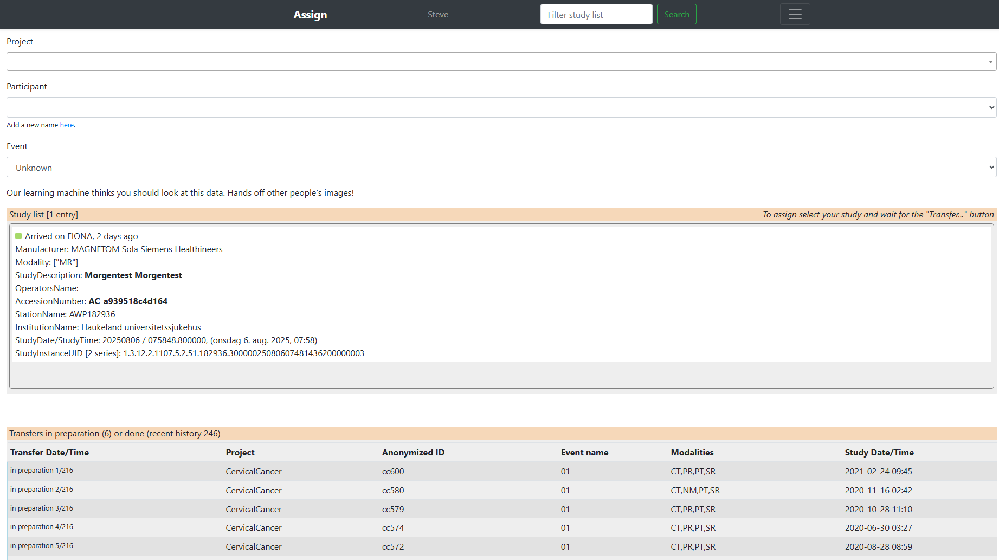

Submit data to the Research Information System 
------------------------------------------------

**The Research Information System** (RIS) contains two components. First, image data is stored in the Sectra DMA Forskning - an image viewer with a vendor neutral archive (VNA). Second, all meta-data is stored in table format in an electronic data capture system REDCap, that is Fiona server on port 4444, (|fiona-redcap_url|). Sending image data will create the appropriate entries in |fiona-redcap_name|. Additional data collection instruments can be set up there and used to capture assessments, consent/assent and results from automated image processing. All image data is assigned to a project to allow for project specific data views for each research information user.

The basic steps to submit data are:

1. Send DICOM studies to “Fiona” (either from clinical PACS or direct from modality station)
2. |fiona-assign_name| to project on |fiona-assign_url|.

In step 1 data arrives in a **quarantine** location. In step 2 each DICOM study needs to be **assigned to project**, pseudonymized participant identifier and event name before it will be forwarded to the research PACS and becomes visible to the project users.

.. raw:: html

   

**Setup of a new project**

The project needs to exist on the research information system before participant data is collected. After a successful setup your project and event names should appear in the Assign application.

**How to add image data**

The end-point for images is |fiona_name| (|fiona_url|):

- AETitle: |fiona-AETtitle_name|
- |fiona-local-ip_name|
- Port: 11112

Images that arrive at this endpoint are added to a quarantine system (Fiona, |fiona-redcap_url|) running the REDCap software. Automatic routing rules (stored in REDCap) are used to anonymize and forward the data to the image storage. If such routing has not been set up, the “Assign” application (see below) needs to be used to forward individual studies based on pre-existing patient ID lists.

From Sectra Production you can send image data to the endpoint “HBE Fiona”. Modality stations might also have the “Fiona” endpoint setup. If the data is already anonymized and has a de-identified PatientName/PatientID entry that indicates the project the Fiona system will attempt to de-identify (pseudonymization) further DICOM tags and forward the images to IDS7 (may take minutes). No further action is needed. If you suspect this did not work, see the corresponding section about the representation of transfers in REDCap.

Image data that contains patient information cannot be automatically assigned to the appropriate project as there is only a single endpoint for Fiona shared by all projects. To assign participants correctly to projects and de-identified participant identifiers a user can perform the assignment to project, participant ID and event name in the “Assign” web application.

If the participant identifiers do not exist yet user may add new project specific identifiers in “Assign”. Such identifiers need to follow the naming rules for a project and are verified using regular expression pattern specific for each project.

The web application for the assignment of scans forwarded to HBE Fiona is available at: |fiona-assign_url|. 

On the Assign website look for your forwarded study. It should appear in about 15 min.
Identify the correct scan using the Accession Number (Undersøkelse-ID) or the date and time
of the scan. Select your project from the drop-down. This will fill in the list of patient names
and event names. Select the correct patient name and the event this study belongs to. After
a couple of seconds a new button appears below the study entry. Use it to select and
confirm the assignment. This will forward a de-identified version of the study data to “Sectra
Forskning”. If you do not assign your data on Assign they will not be forwarded. After a
couple of days (7 days) such data will disappear from the list. Send an email to |admin_url| to request a resend.

**Verification steps**

After data arrived at the research PACS a verification step should ensure that all images have been received at the quarantine on Fiona and have been forwarded to research PACS. This can be done by comparing the number of images on the sending station with the number of images in IDS7.

Furthermore the import step will also attempt to de-identify secondary capture images with burned in image information. This process is fully automated and can result in false positive and occasionally false negative results. After a review of the data in IDS7 the user may decide which secondary image series are “safe” to exclude from the pixel rewriting on import. For example a secondary capture series from DTI may not contain any burned in names or identifying numbers or dates. Such image series can be removed in REDCap from further pixel anonymization.

If the number of images on Fiona does not correspond to the number of images available cache previous assignments and automatically forward such images to the research PACS using the previously defined project, patient identifier and event name.

**Features for data migration**

The |fiona-assign_name| web-application allows users to upload a coupling list that maps the accession
number (Undersøkelse-ID) of the study to the pseudonymized participant identifier. Such
mappings must be uploaded before the first image study of the project has been forwarded
to Fiona. Incoming DICOM studies in Fiona that match entries in the coupling list will
automatically be assigned to the project.

**How to handle errors?**

Correcting errors during data import are not difficult to fix. Try to follow up on such errors
on an ongoing basis. The quarantine Fiona station may have still have a copy of the data in
its cache which simplifies the process. Contact |admin_name| in such cases and ask for help. This will allow you to fix issues such as:

• Wrong assignment of participant identifiers to DICOM studies
• Wrong assignment of event names to DICOM studies
• Missing images or image series for existing DICOM studies
• Missing entries for DICOM studies on “Assign".